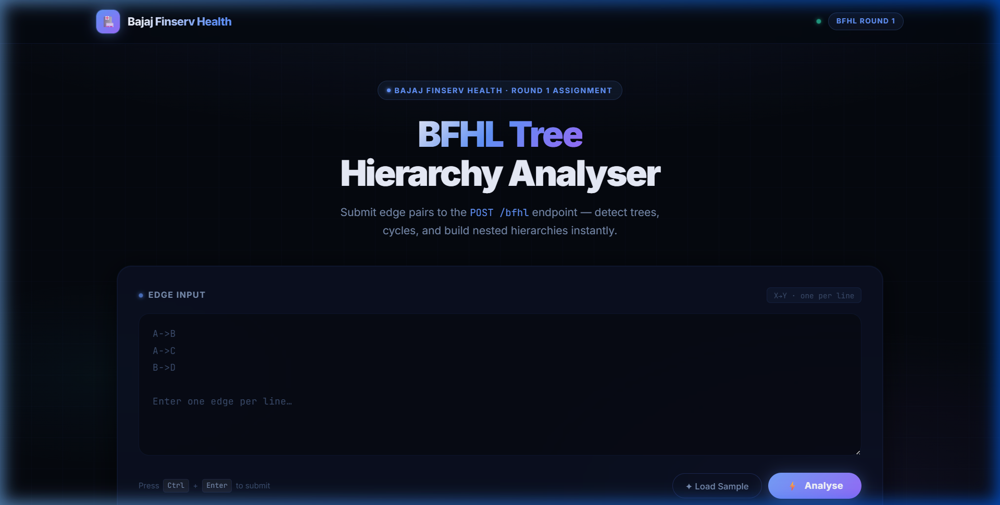
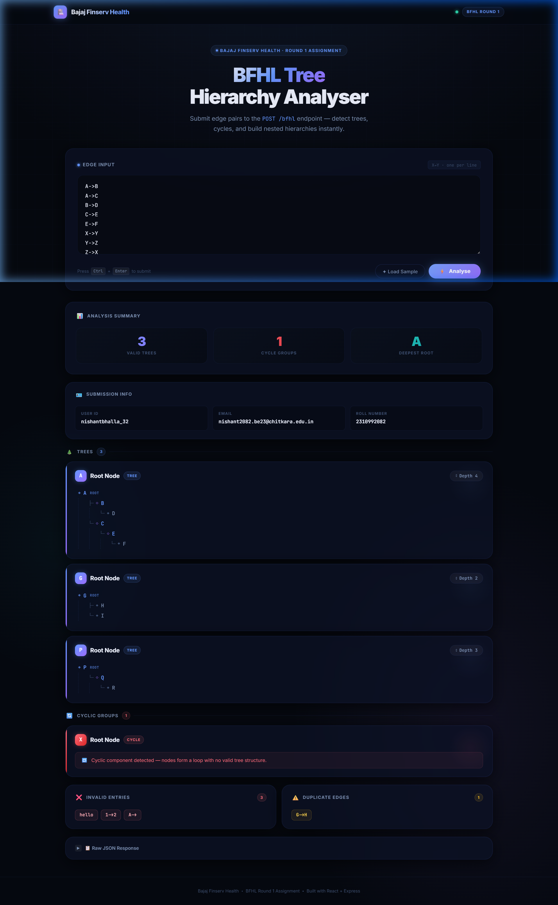

# BFHL Tree Hierarchy Analyser

> **Bajaj Finserv Health · Round 1 Assignment**  
> A full-stack application to process directed edge pairs, detect cyclic dependencies, and build nested tree hierarchies via a REST API.

---

## 📸 Screenshots

### Frontend — Input & Analysis UI


> *Edge input panel with Load Sample and Analyse controls*

### Frontend — Results View


> *Analysis summary, tree hierarchies, cyclic groups, invalid entries, and raw JSON response*

---

## 🧩 Project Structure

```
bajaj-assignment1/
├── backend/                    # Node.js + Express REST API
│   ├── controllers/
│   │   └── bfhlController.js   # Core hierarchy processing logic
│   ├── routes/
│   │   └── bfhl.js             # Route definitions
│   ├── utils/
│   │   ├── graphBuilder.js     # Edge parsing & validation
│   │   ├── cycleDetector.js    # DFS-based cycle detection
│   │   ├── treeBuilder.js      # Recursive tree object builder
│   │   ├── depthCalculator.js  # Tree depth computation
│   │   └── validator.js        # Input validation helpers
│   ├── server.js               # Express app entry point
│   ├── vercel.json             # Vercel deployment config
│   └── package.json
│
└── frontend/                   # React + Vite SPA
    ├── src/
    │   ├── components/
    │   │   ├── InputBox.jsx    # Edge input textarea + controls
    │   │   ├── ResultCard.jsx  # Individual hierarchy card
    │   │   ├── Summary.jsx     # Analysis stats panel
    │   │   └── TreeRenderer.jsx# Recursive tree visual renderer
    │   ├── App.jsx             # Root component & API integration
    │   ├── index.css           # Global styles & design system
    │   └── main.jsx
    ├── vercel.json             # SPA rewrite config
    └── package.json
```

---

## ⚙️ Tech Stack

| Layer     | Technology                      |
|-----------|---------------------------------|
| Frontend  | React 19, Vite 8, Axios         |
| Backend   | Node.js ≥ 18, Express 4         |
| Linting   | OXLint                          |
| Deployment| Vercel (frontend + backend)     |

---

## 🚀 Getting Started

### Prerequisites
- Node.js ≥ 18
- npm

### Backend

```bash
cd backend
npm install
npm run dev        # starts on http://localhost:5000
```

### Frontend

```bash
cd frontend
npm install
# Set environment variable
echo "VITE_API_URL=http://localhost:5000" > .env
npm run dev        # starts on http://localhost:5173
```

---

## 🔌 API Reference

### `POST /bfhl`

Accepts a list of edge strings, parses the directed graph, and returns tree hierarchies with cycle detection.

**Request**
```json
{
  "data": ["A->B", "A->C", "B->D", "X->Y", "Y->Z", "Z->X"]
}
```

**Response**
```json
{
  "user_id": "nishantbhalla_32",
  "email_id": "nishant2082.be23@chitkara.edu.in",
  "college_roll_number": "2310992082",
  "hierarchies": [
    {
      "root": "A",
      "tree": { "A": { "B": { "D": {} }, "C": {} } },
      "depth": 3
    },
    {
      "root": "X",
      "tree": {},
      "has_cycle": true
    }
  ],
  "invalid_entries": [],
  "duplicate_edges": [],
  "summary": {
    "total_trees": 1,
    "total_cycles": 1,
    "largest_tree_root": "A"
  }
}
```

### `GET /health`

Returns server health status.

```json
{ "status": "ok", "ts": 1719230400000 }
```

---

## 🧠 Algorithm Overview

| Step | Operation | Detail |
|------|-----------|--------|
| 1 | **Parse & Validate** | Accepts `X->Y` format; rejects malformed entries |
| 2 | **Build Adjacency Map** | Directed edge list → adjacency map |
| 3 | **Cycle Detection** | DFS with visited/recursion stack tracking |
| 4 | **Connected Components** | Union-Find with path compression |
| 5 | **Tree Construction** | Recursive nested object per acyclic component |
| 6 | **Depth Calculation** | BFS from each root node |
| 7 | **Response Building** | Sorted: acyclic trees first, then cyclic groups |

---

## 🌐 Deployment

Both services are deployed on **Vercel**.

| Service  | URL |
|----------|-----|
| Backend  | `https://bajaj-assignment1-rho.vercel.app` |
| Frontend | Configured via `VITE_API_URL` in `.env` |

The backend `vercel.json` routes all requests through `server.js`. The frontend `vercel.json` rewrites all paths to `index.html` for SPA support.

---

## 👤 Author

**Nishant Bhalla**  
B.E. 2023 · Chitkara University  
Roll No: `2310992082`  
Email: `nishant2082.be23@chitkara.edu.in`
